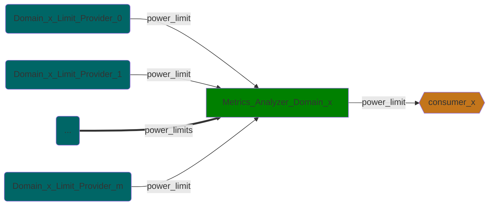
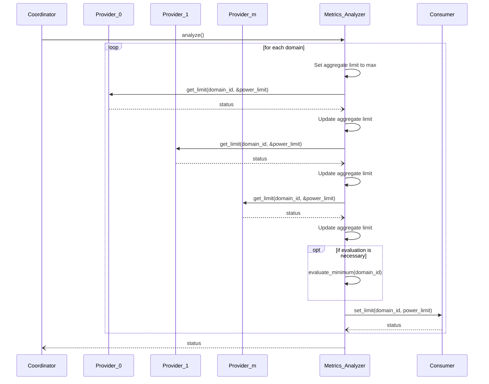

\ingroup GroupModules Modules
\defgroup GroupMetrics Metrics service

# Metrics

Copyright (c) 2024, Arm Limited and Contributors. All rights reserved.

## Overview

The metrics analyzer module is a service module that represents the analysis
phase from the power management flow.

This module is responsible for collecting the limits from the power limit
providers and then determining the final power limits for system domains.

The system domains are bound by the lowest power limit metric.

## Data Flow

This module **consumes** `power limits` from multiple providers.

Limits providers must implement `get_limit` API which returns the power_limit
for the givin domain.

The following diagram shows the data flow for each domain (domain view)

> Where `x` belongs to [0,`N`] and `N` is the number of domains.

The relationship between the providers and a domain is many to one,
while each domain has only one consumer.

## Operation

When the analyze API is called, for each domain, the power limit of each metrics analyzer domain is aggregated from the list of power limits collected
per metric.

